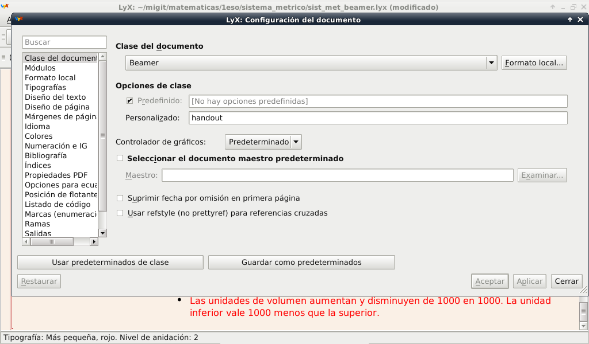

Handouts en documentos Lyx
################################

:date: 2015-08-21
:tags: 
:category: Lyx
:authors: Carlos Rodríguez
:summary: Handouts en documentos Beamer con Lyx

Para poner compilar los documentos sin tener en cuenta las pausas que pongamos a nuestra presentación, tenemos que indicar la clase *handouts* a nuestro documento *beamer*:

