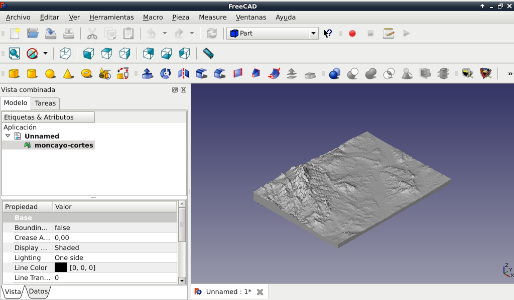

Mapas de Google para imprimir en 3D
####################################

:date: 2015-09-05
:tags: 3D
:category: 3D
:authors: Carlos Rodríguez
:summary: Imprimir en 3D mapas

Para poder imprimir en 3D mapas de Google Maps, he ecnontrado una aplicación
en *Github* de **ThatcherC** llamada **Terrain2STL**.

El proyecto está aquí: https://github.com/ThatcherC/Terrain2STL

Y la aplicación web aquí: http://jthatch.com/terrain2stl/

Cuando lo haya probado, comentaré mis impresiones.

De momento aquí va una imagen del mapa 3D del Moncayo y las Bardenas Reales (Aragón, Castilla-León y Navarra) vistos desde **FreeCad**:
 

