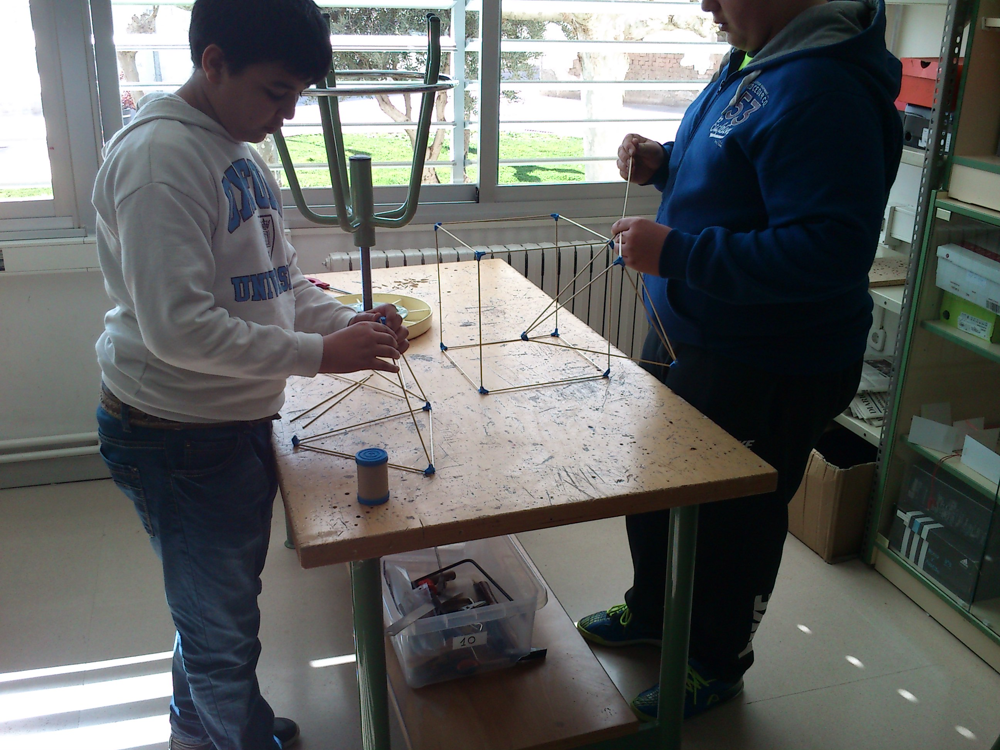

Artículo para el diario de Navarra
#################################################

:date: 2015-10-07
:tags: Maker
:category: Maker
:authors: Carlos Rodríguez
:summary: Artículo Espacio Maker para el Diario de Navarra

    Este año vamos a intentar realizar un espacio Maker en el instituto IESO Bardenas Reales. La idea se presentó como proyecto de innovación y ha sido aceptada. Veremos qué somos capaces de hacer. 

Qué es un espacio Maker y cómo surge la iniciativa:

Cortes, curso 2014-2015: El centro se propone como reto construir una Impresora 3D de bajo coste. Algo que parecía ciencia-ficción era posible de hacer gracias a la información disponible en Internet: proyecto *REPRAP*  (http://www.reprap.org/).
La idea principal del proyecto *REPRAP* era la construcción de impresoras auto-replicantes, es decir, que están construidas con piezas que hayan sido impresas por otras impresoras.

Algunas fotos del año pasado:

.. figure:: ./img/probando.jpg
	:align: right
	:width:	400 px
	:alt:	'Probando la Impresora'
	
	(Probando la impresora)
		   
.. figure:: ./img/impresora_completa.JPG
	:width:	400 px
	:alt:	'Impresora completa'
	
	(La impresora completa)
	

	
	(Construyendo sólidos platónicos)
	
Pero al buscar información en Internet de estas impresoras 3D, vimos que existía detrás una comunidad extremadamente activa cuya principal motivación era la construcción de cosas para aprender. Se trata de una versión moderna de los antiguos aficionados al bricolaje e inventores caseros, pero basados en la tecnología y con la ventaja de utilizar Internet para difundir todo el conocimiento, y por tanto de hacerlo accesible. En EEUU, a este tipo de personas se les llamó makers y pronto aparecieron locales donde socializar, construir y compartir ideas: Fablab o Makespace son los nombres más comunes. 

Pedagógicamente, el movimiento maker ha aportado a la educación el fomento de la creatividad e innovación. También ha contribuido al desarrollo de un nuevo paradigma educativo de siglas STEAM (acrónimo de Cience, Technology, Engineering, Arts y Mathematics), y que promulga el desarrollo de dichas disciplinas desde una perspectiva transversal y conjunta.

La importancia que se le está dando a este movimiento ha hecho que a hasta el presidente de los EEUU, Barak Obama, esté promoviendo el uso de impresoras 3D en los centros educativos o que se organice desde la Casa Blanca la Semana Maker (https://www.whitehouse.gov/nation-of-makers)

Con las ideas anteriores, desde el centro pretendemos construir un espacio de creación digital y no digital en el que se puedan desarrollar diferentes proyectos. Algunos de los retos planteados para este año son:

    - Elaborar un **mobiliario móvil** que, hasta que tengamos asignado un espacio físico real, permita dividir una estancia en dos ambientes a través de separadores móviles elaborados con palets. También con Palets podremos crear algún tipo de bancada que dé al espacio un toque "maker".
    
    - Fomentar el pensamiento computacional como forma de afrontar y resolver problemas o retos y que tiene similitudes con el algebra como forma de abstraer y resolver matemáticamente problemas de la vida real. Para ello vamos a hacer el curso de **sctratch** que tenemos en la página **código 21**: http://aprendecodigo21.educacion.navarra.es/
    
    - Introducción a la electrónica mediante proyectos con Arduino. El año pasado, en el proyecto de la impresora 3D descubrimos que para el modelado 3D existe una herramienta online muy sencilla e intuitiva: **Tinkercad** (https://www.tinkercad.com/). Autodesk, actual propietaria de Tinkercad, está detrás de un montón de aplicaciones online educativas y relacionadas con el mundo maker. La aplicación **123d Circuits** permite implementar proyectos con Arduino de forma virtual (https://123d.circuits.io/)
    
    - Aprovechando el Huerto Escolar, trabajar los hábitos de salud estudiando las virtudes de los productos de la huerta y ayudar mediante la **impresión 3D** a la elaboración de letreros y soportes decorativos 

Pedagñiogicamente, el movimiento maker aporta a la educación el fomento creatividad e innovación y ha aparecido un nuevo paradigma educativotransversal de siglas STEM

La importancia que se le está dando a este movimiento ha hecho que a hasta el presidente de los EEUU Obama esté promoviendo el uso de impresoras 3D en los centros educativos o que se haya celebrado una feria en la misma CasaBlanca y la maker faire

Para saber más sobre el movimiento maker, se puede consultar, por ejemplo, la web del Makespace Madrid (http://makespacemadrid.org)
