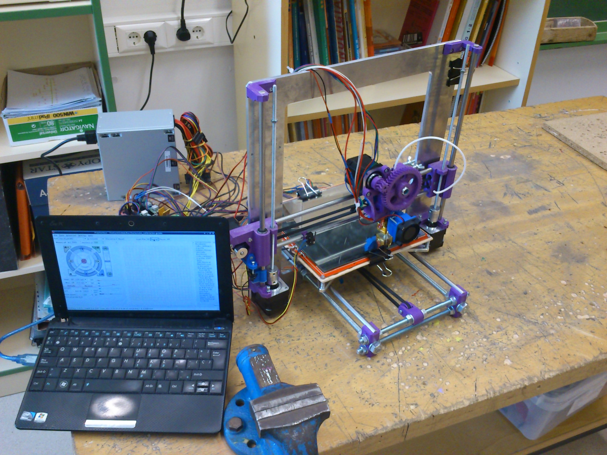

Artículo para el diario de Navarra
#################################################

:date: 2015-10-07
:tags: Maker
:category: Maker
:authors: Carlos Rodríguez
:summary: Artículo Espacio Maker para el Diario de Navarra

**BORRADOR - DRAFT**

Este año vamos a intentar realizar un espacio Maker en el instituto IESO Bardenas Reales. La idea se presentó como proyecto de innovación y ha sido aceptada. Veremos qué somos capaces de hacer. 

Qué es un espacio Maker y cómo surge la iniciativa:

Cortes, curso 2014-2015: El centro se propone como reto construir una Impresora 3D de bajo coste. Algo que parecía ciencia-ficción era posible de hacer gracias a la información disponible en Internet: proyecto REPRAP.
La idea principal del proyecto REPRA era la construcción de impresoras auto-replicantes, es decir, que están construidas con piezas que hayan sido impresas por otras impresoras.

	
	(Imagen de la impresora del centro)

Pero al buscar información en Internet de estas impresoras 3D, vimos que existía detrás una comunidad extremadamente activa cuya principal motivación era la construcción de cosas para aprender. Se trata de una versión moderna de los antiguos aficionados al bricolaje e inventores caseros, pero basados en la tecnología y con la ventaja de utilizar Internet para difundir todo el conocimiento, y por tanto de hacerlo accesible. En EEUU, a este tipo de personas se les llamó makers y pronto aparecieron locales donde socializar, construir y compartir ideas: Fablab o Makespace son los nombres más comunes. Desde el centro vamos a construir un espacio de creación digital y no digital en el que se puedan desarrollar diferentes proyectos. Algunos de los retos planteados para este año son:

    - Elaborar un **mobiliario móvil** que, hasta que tengamos asignado un espacio físico real, permita dividir una estancia en dos ambientes a través de separadores móviles elaborados con palets. También con Palets podremos crear algún tipo de bancada que dé al espacio un toque "maker".
    
    - Fomentar el pensamiento computacional como forma de afrontar y resolver problemas o retos y que tiene similitudes con el algebra como forma de abstraer y resolver matemáticamente problemas de la vida real. Para ello vamos a hacer el curso de **sctratch** que tenemos en la página **código 21**: http://aprendecodigo21.educacion.navarra.es/
    
    - Introducción a la electrónica mediante proyectos con Arduino. El año pasado, en el proyecto de la impresora 3D descubrimos que para el modelado 3D existe una herramienta online muy sencilla e intuitiva: **Tinkercad** (https://www.tinkercad.com/). Autodesk, actual propietaria de Tinkercad, está detrás de un montón de aplicaciones online educativas y relacionadas con el mundo maker. La aplicación **123d Circuits** permite implementar proyectos con Arduino de forma virtual (https://123d.circuits.io/)
    
    - Aprovechando el Huerto Escolar, trabajar los hábitos de salud estudiando las virtudes de los productos de la huerta y ayudar mediante la **impresión 3D** a la elaboración de letreros y soportes decorativos 

Pedagñiogicamente, el movimiento maker aporta a la educación el fomento creatividad e innovación y ha aparecido un nuevo paradigma educativotransversal de siglas STEM

La importancia que se le está dando a este movimiento ha hecho que a hasta el presidente de los EEUU Obama esté promoviendo el uso de impresoras 3D en los centros educativos o que se haya celebrado una feria en la misma CasaBlanca y la maker faire

Para saber más: makespace madrid y manual de supervivencia

El alumnado del IESO Bardenas Reales desarrolla su creatividad a través de la tecnología 3D
Durante el presente curso y a través de varios trabajos, el Instituto está introduciéndose en el manejo de las tecnologías 3D. Si la punta del iceberg de lo que se viene haciendo es la construcción de una impresora 3D OpenSource, éste no ha sido el único trabajo.  Algunas de las líneas de actuación que se vienen desarrollando desde el comienzo de curso son:

* Construcción de impresora 3D OpenSource, modelo PRUSA I3
* Diseño de objetos en 3D con software específico (Freecad y Tinkercad)
* Estudio y trabajos sobre las propiedades físicas de los diferentes materiales de impresión (ABS y PLA)
* Estudio de las coordenadas polares en el plano-espacio (fáciles de manejar por el ser humano) y su transformación a coordenadas cartesianas (fáciles de manejar por la impresora 3D)

Metodológicamente, el trabajo que se está realizando se basa en la filosofía del Conocimiento Libre. Para ello, todos los viernes durante el segundo recreo nos reunimos tanto el alumnado como parte del profesorado para colaborar, participar o simplemente charlar en el aula de tecnología sobre lo que se ha estado haciendo durante la semana (por cierto, si estás cerca de Cortes, estás invitado: todos los viernes a las 12:00). 

Como todo proceso creativo, mientras vamos construyendo nuestra impresora 3D, van surgiendo nuevas iniciativas, y seguro que para cuando leas estas líneas a alguien se le ha ocurrido algo interesante relacionado con el tema. ¡Y eso que todavía no tenemos la impresora operativa al 100%! (Bueno, un profesor tiene una en su casa).

Desde el Instituto, consideramos que el fomento de la creatividad en el alumnado constituye una potente herramienta de aprendizaje. Crear un libro, un dibujo, un canción, una coreografía o un corto pueden ser excelentes maneras de no sólo adquirir conocimiento, sino también de desarrollar el espíritu crítico. Hasta ahora la tecnología e internet nos habían permitido “democratizar” (hacer accesible) la fabricación y el consumo de creaciones escritas, o audiovisuales. Sin embargo, esta democratización del mundo digital se está trasladando también al mundo físico: con una impresora 3D, las ideas las podemos materializar en objetos de forma rápida y barata.

A pesar de considerar más importante la labor educativa de formar personas que la de dotar de recursos humanos al sistema productivo, es evidente que la integración del individuo en nuestra sociedad implica que pueda acceder a un puesto de trabajo. En ese sentido encontramos un nuevo argumento para fomentar la creatividad a partir de la competencia clave “sentido de iniciativa y espíritu emprendedor” que establece la ley. La crisis económica en los países más desarrollados, la globalización y la imposibilidad de competir con los países emergentes en cuanto a costes, obliga a los países de la Unión Europea a buscar ventajas competitivas a través de la “creatividad” y la innovación.

Por último, si eres de los que de niño o niña “creabas” cosas con lo que tuvieras en casa, deberías preguntarte por qué no sigues haciéndolo ahora…

 B9vBJTfIAAAmRZI_003.jpg 
 B9vBKJ5IEAI_5a8_002.jpg 
 B66ZxD0CIAAphP9.jpg 

 B115XPTIYAMRtMW.jpg 

 DSC_0999.jpg 

Para saber más: https://sites.google.com/site/cortes3dwiki/

