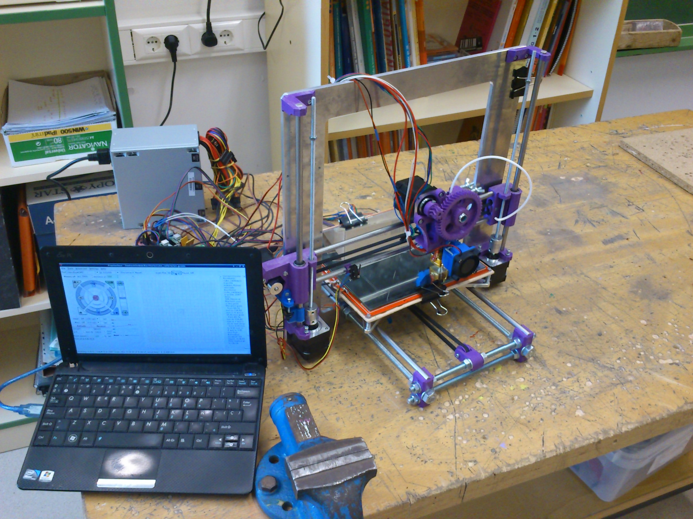

Programas para modelar en 3D
#################################################

:date: 2015-12-22
:tags: Varios
:category: Maker
:authors: Carlos Rodríguez
:summary: Programas para modelar en 3D

Aquí van una colección de programas para modelar en 3D

	#. FreeCAD: Posiblemente el más completo y profesional
	#. Blender: No lo he probado pero parece el más artístico
	#. OpenScad: Modelado paramétrico
	#. BlocksCad: Interfaz limitada de OpenScad, con la ventaja de poder trabajar online
	#. TinkerCad: Sencillo y online, ideal para llevarlo al aula (como el anterior)
	#. OnShapes: Otro online, parece más profesional. No lo he probado

	
	(Imagen de la impresora del centro)

