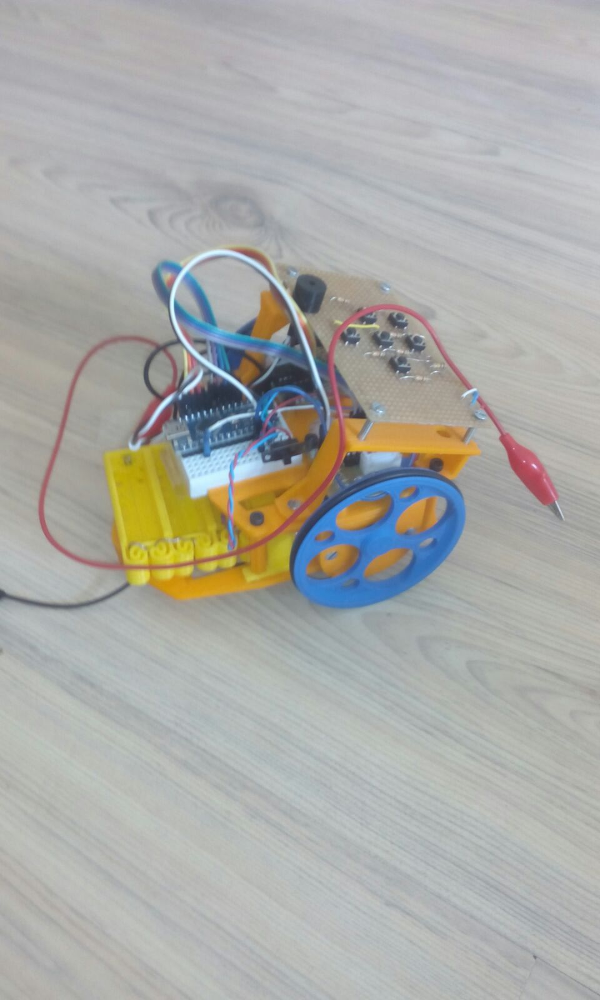

Parámetros para el cálculo de pasos para un escornabot
##########################################################

:date: 2016-10-28
:tags: Varios
:category: Maker
:authors: Carlos Rodríguez
:summary: Cálculo de pasos para un escornabot

A la hora de calibrar un robot de dos ruedas siempre surge el tema de qué orden hay que darle al robot para que recorra cierta distancia o gire cierto número de grados. 

Para el recorrido recto influye el diámetro de la rueda que estemos usando, y en el giro la distancia entre las ruedas, que al final será el diámetro de la circunferencia que realice el robot mientras gira.

Vamos a poner el ejemplo del escornabot (modelo placidus) que es el que he montado. Según datos teóricos, el número de pasos es de **64** por **64** de la reductora, por lo que da un total de 4096 pasos por vuelta (para el modelo de motor que tengo recomiendan poner **4076**).

El diámetro de la rueda es de 72mm y la distancia entre ruedas es de 100mm.

Con simples reglas de tres y que pi*diametro es una vuelta podemos determinar los pasos que tiene que dar nuestro robot:

Pasos hacia para desplazarse:   Si 4076 es pix72, entonces 200 será x   Lo que da que x=3603 pasos
Pasos para girar 90 grados:     Si 4076 es pix72, entonces (pix100)/4   Luego x=1415 
